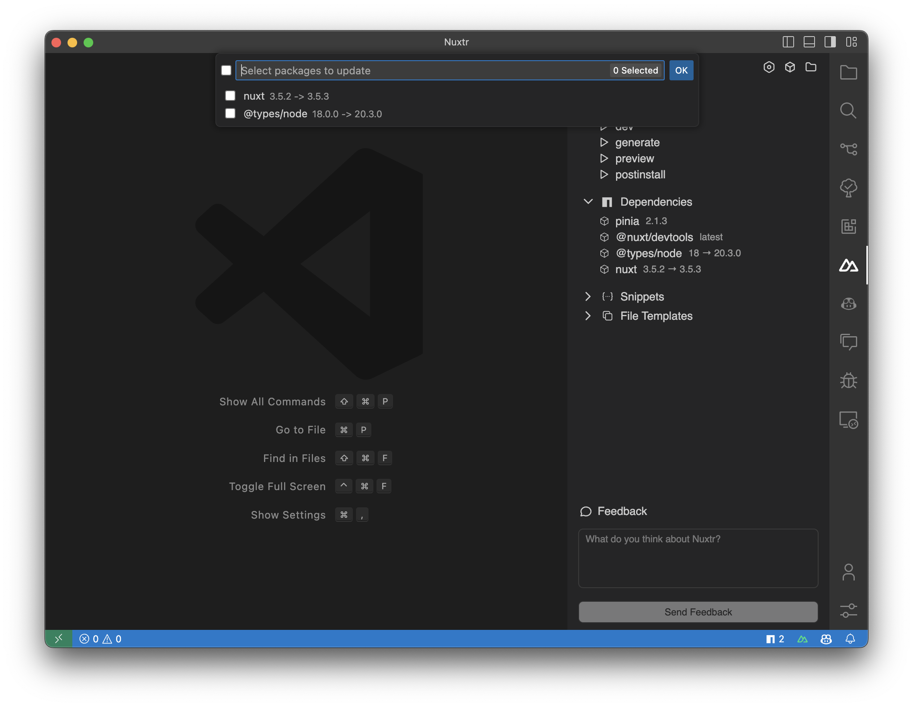
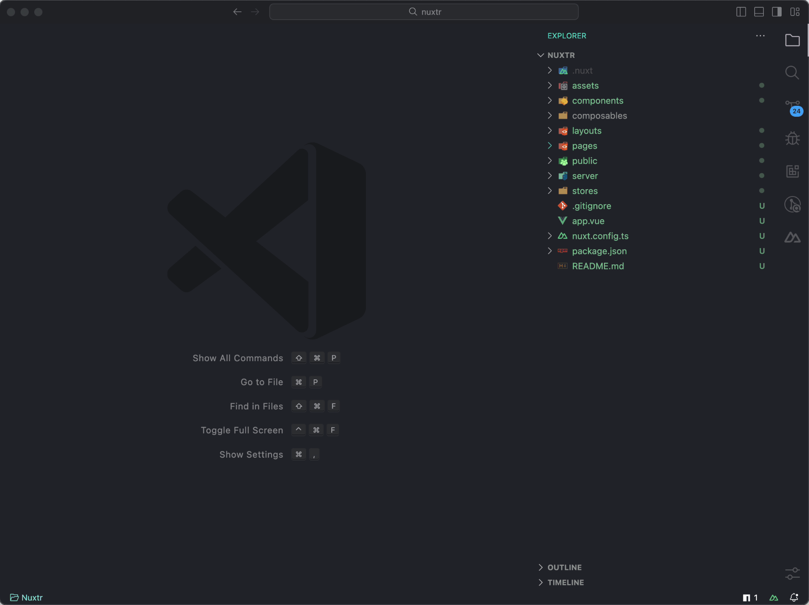
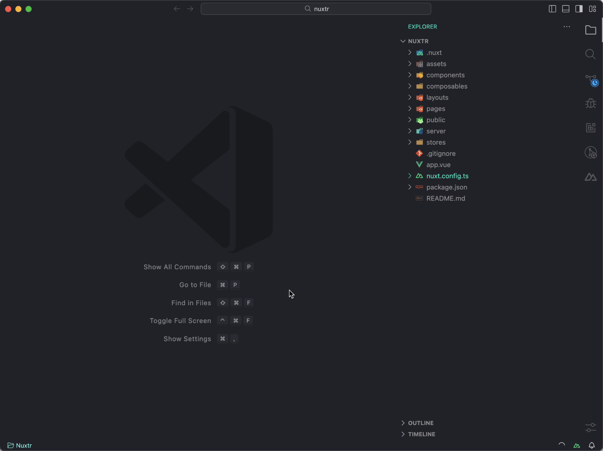
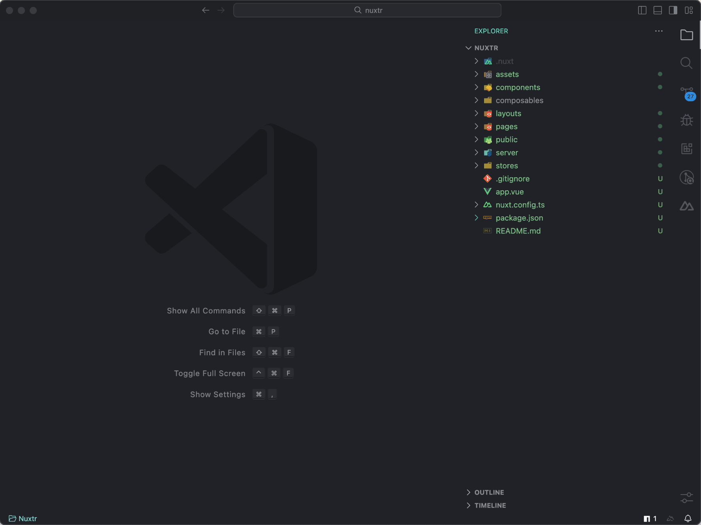
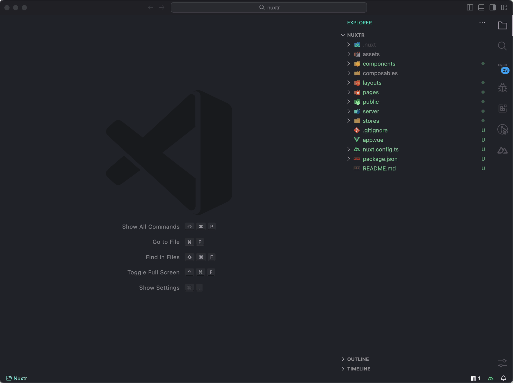

<br />

<div align="center">
  

  <h3 align="center">Nuxtr VSCode</h3>

  <p align="center">
    An extension offering commands and tools <br /> to make your experience with Nuxt more pleasant!
  </p>

  <p align="center">
    <a href="https://marketplace.visualstudio.com/items?itemName=Nuxtr.nuxtr-vscode" target="_blank">
      
    </a>
  </p>

  <p align="center">
    <a target="_blank" href="https://github.com/nuxtrdev/nuxtr-vscode/issues/new?assignees=&labels=bug%2Ctriage&projects=&template=issue.yaml&title=%5BBug%5D%3A+">
      <strong>Report Bug</strong> »
    </a>
    ·
    <a target="_blank" href="https://github.com/nuxtrdev/nuxtr-vscode/discussions/new/choose">
      <strong>Start a Discussion</strong> »
    </a>
  </p>
</div>

<br>

### What does Nuxtr do?

- [Project directories and files creation](#project-directories-and-files-creation)
- [Dependencies management](#dependencies-management)
- [Nuxt/Custom Snippets](#nuxtcustom-snippets)
- [IntelliSense and Auto Completion](#intellisense-and-auto-completion)
- [Vue File Templates](#vue-file-templates)
- [srcDir, serverDir and monorepo support](#srcdir-serverdir-and-monorepo-support)
- [Run scripts from the VSCode command palette or sidebar.](#run-scripts-from-the-vscode-command-palette-or-sidebar)
- [Toggle Nuxt Devtools from your status bar](#toggle-nuxt-devtools-from-your-status-bar)
- [Search and install Nuxt integrations](#search-and-install-nuxt-integrations)
- [Install & Configure CSS frameworks and Linters](#install--configure-css-frameworks-and-linters)

<br>
<br>

### Project directories and files creation

With just a few clicks or using commands and context menus, you can effortlessly create all the necessary directories and files for your Nuxt project, including Vue/TypeScript files, special files like [`.nuxtignore`](https://nuxt.com/docs/guide/directory-structure/nuxtignore), [`.nuxtrc`](https://nuxt.com/docs/api/configuration/nuxt-config) and [`app.config.ts`](https://nuxt.com/docs/guide/directory-structure/app-config). The flexibility extends to supporting both flat and subdirectory structures.

You can customize Vue file templates using the following settings:

```JSON
  "nuxtr.vueFiles.firstTag": "template",
  "nuxtr.vueFiles.script.type": "setup",
  "nuxtr.vueFiles.script.defaultLanguage": "ts",
  "nuxtr.vueFiles.style.addStyleTag": true,
  "nuxtr.vueFiles.style.alwaysScoped": true,
  "nuxtr.vueFiles.style.defaultLanguage": "scss"
```

And auto open the created file using:

```JSON
  "nuxtr.openItemsAfterCreation": true
```


<br>
<br>

### Dependencies management

**Package Manager Detection**: Detecting your package manager if a lock file exists. Or letting you choose which package manager to use with this setting. You can select your default package manager from the setting:

```JSON
  "nuxtr.defaultPackageManager": "pnpm"
```

**Dependency Removal and Upgrade/Downgrade**: From sidebar inside project view, You can remove or upgrade/downgrade your dependencies by selecting which version you want to install.

**Status Bar Icon**: In your statusbar you can see your outdated dependencies and update them with few clicks.

<br>



<br>
<br>

### Nuxt/Custom Snippets

**Nuxt Snippets**: You can use Nuxt snippets by typing `nuxt` for components, `use` for Composables or just start typing Nuxt utils and selecting your snippet from the list.

Nuxt Snippets is enabled by default. You can enable/disable them using this setting.

```JSON
 "nuxtr.snippets.nuxt": true
```

**Nitro Snippets**: Nitro is empoweing Nuxt Server Engine. Please, refer to [Nitro Docs](https://nitro.unjs.io) for more information.

Nitro Snippets is enabled by default. You can enable/disable them using this setting.

```JSON
 "nuxtr.snippets.nitro": true
```

**Custom Snippets**: Easily manage your custom snippets from the sidebar. You can create, edit or delete your snippets.

More on this side of the extension is coming soon!


<br>
<br>

### IntelliSense and Auto Completion

Nuxtr VSCode offers a robust IntelliSense with focused support for Vue files, offering relative path completion from the pages directory for [NuxtLinks](https://nuxt.com/docs/api/components/nuxt-link#internal-routing) and from the [public or static directories](https://nuxt.com/docs/guide/directory-structure/public) for media resources, depending on your Nuxt version. Moreover, it offers IntelliSense for essential configuration files like [`.nuxtignore`](https://nuxt.com/docs/guide/directory-structure/nuxtignore) and [`.nuxtrc`](), empowering you with accurate insights and efficient coding.

You can enable/disable IntelliSense from the settings:

```JSON
 "nuxtr.intellisense.nuxtrc": true,
 "nuxtr.intellisense.vueFiles": true,
 "nuxtr.intellisense.nuxtignore": true,
```

<br>
<br>

### Vue File Templates

To provide users with greater flexibility in customizing their Vue files, we offer the ability to create and utilize personalized templates. These templates can be set as defaults or used selectively as per the user's preference.

We currently support two types of templates for ensuring a consistent user experience: `.page-template` and `.layout-template`. When Nuxt is loaded, these files are treated as regular Vue files, simplifying the editing process. Templates creation can be done from existing respective files via context menu item or empty templates from sidebar.

You can set your default template from these settings:

```JSON
"nuxtr.vueFiles.pages.defaultTemplate": "default.page-template",
"nuxtr.vueFiles.layouts.defaultTemplate": "default.layout-template"
```



<br>
<br>

### srcDir, serverDir and monorepo support

Nuxtr supports `srcDir`, `serverDir` and monorepo projects. You can set your `srcDir` from your `nuxt.config.ts` file and Nuxtr will create files/directories in the right place for you.

```JSON
  "srcDir": "src",
  "serverDir": "server"
```

Or locate your nuxt project in your monorepo using this setting in `.vscode/settings.json`:

```JSON
  "nuxtr.monorepoMode.DirectoryName": "directory-name"
```

<br>
<br>

### Run scripts from the VSCode command palette or sidebar

Main scripts are available from command palette, if you want to use a custom command you can find it in the sidebar. Besides `nuxt dev` command, all other commands run in the background and you can see the output in the VSCode output channel.


<br>
<br>

### Toggle Nuxt Devtools from your status bar

[Nuxt Devtools](https://devtools.nuxtjs.org/) is a great tool! One of the great features it offer is working globally with your project if you are using Nuxt <= 3.4.0. You can toggle it from your status bar. Extension detects your Nuxt version and advices you to update if not.

Manual toggling from nuxt.config.ts is detected and state is synced.



<br>
<br>

### Search and install Nuxt integrations

Almost full support for Nuxt modules with a typical searching/filters experience as Nuxt Modules directory. Once you have found your desired module and detected your package manager, it will be installed and added to the nuxt.config file. A success message will be displayed, along with a button to access the module documentation.

Starting from v0.1.0, you can filter integration types (modules/layers) from the sidebar.



<br>
<br>

### Install & Configure CSS frameworks and Linters

You can install and configure most CSS frameworks with few steps:

- Tailwind CSS.
- UnoCSS.
- WindiCSS (RIP).
- Vueitfy.

Same for linters:

- Stylelint.
- Eslint.

More coming soon.



<br>

### License

[MIT](https://github.com/nuxtrdev/nuxtr-vscode/blob/main/LICENSE) License © 2023.

<br>

### Contributing

We always welcome new ideas! 💚 <br>
If you have any idea, feel free to [open a discussion](https://github.com/orgs/nuxtrdev/discussions/new?category=ideas) first and let's talk about it!

<br>

### Acknowledgements

Nuxtr VSCode relies on the following projects/repositories:

- [Nuxt Modules](https://github.com/nuxt/modules)
- [Nuxt Assets](https://github.com/nuxt/assets)
- [Tabler Icons](https://tablericons.com/)
