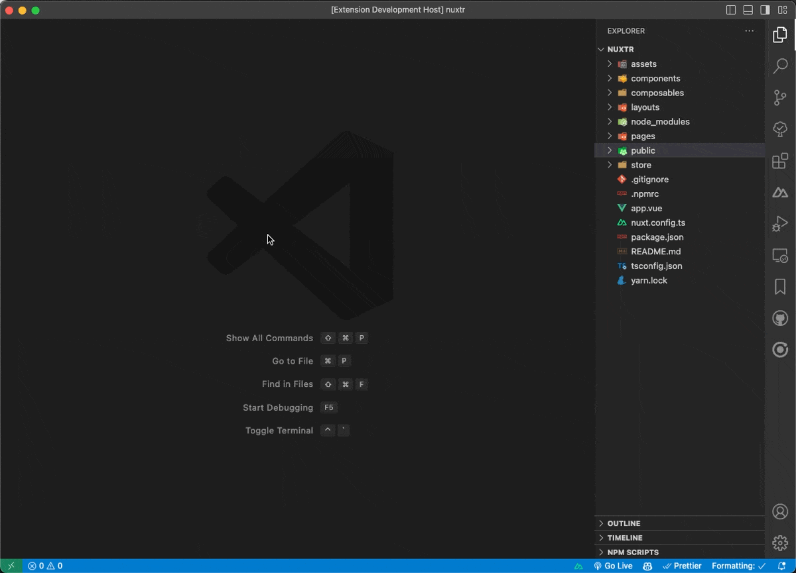
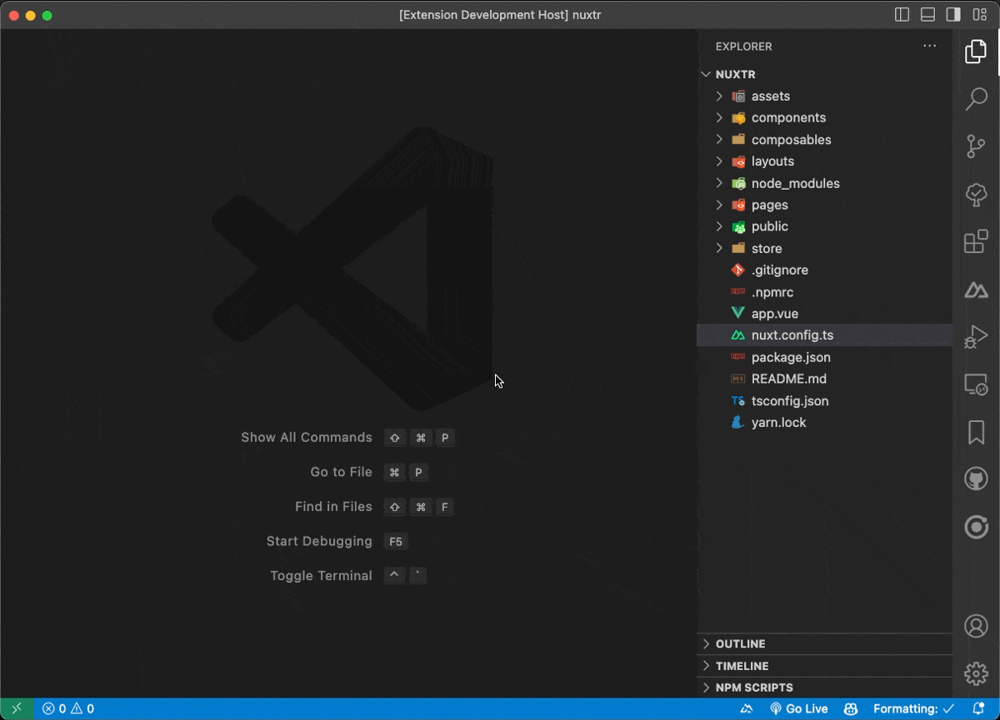
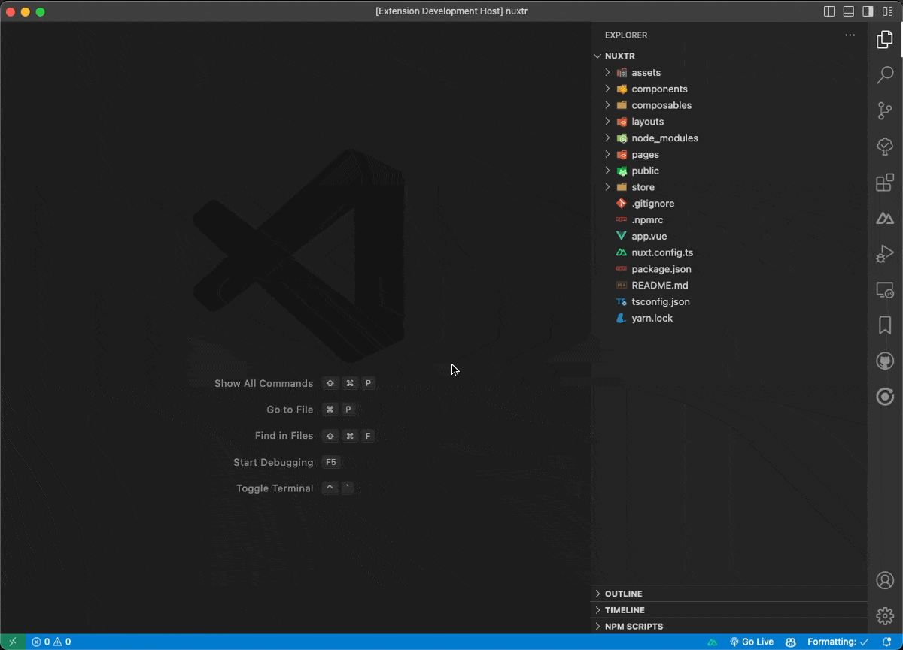

### What does Nuxtr do?

Nuxtr VSCode extension offers a set of commands and tools to help with your Nuxt.js development workflow. You can create items (components, pages, layouts, stores, etc.), run Nuxt.js commands from the VSCode command palette. Toggle Nuxt Devtools from your status bar, manage your Nuxt.js project dependencies, find, install and add your modules to nuxt.config.ts files with one click and more.

<br>

### Features

- [Create Nuxt project directories](#create-nuxt-project-directories)
- [Create Nuxt.js files](#create-nuxtjs-files)
- [Installing dependencies](#installing-dependencies)
- [Run scripts from the VSCode command palette or sidebar.](#run-scripts-from-the-vscode-command-palette-or-sidebar)
- [Toggle Nuxt Devtools from your status bar](#toggle-nuxt-devtools-from-your-status-bar)
- [Install, remove and update project dependencies.](#install-remove-and-update-project-dependencies)
- [Search and install nuxt modules.](#search-and-install-nuxt-modules)
- [Configure most CSS frameworks with few steps](#configure-most-css-frameworks-with-few-steps)


<br>
<br>

### Create Nuxt project directories


<br>
<br>

### Create Nuxt.js files
You can create all kind of files that Nuxt.js needs (Vue/TypeScript) and special files like [`.nuxtignore`](https://nuxt.com/docs/guide/directory-structure/nuxtignore) and [`app.config.ts`](https://nuxt.com/docs/guide/directory-structure/app-config) files. Flat/sub directories structure are supported too.


You can customize Vue file templates using the following settings:

```JSON
  "nuxtr.vueFiles.firstTag": "template",
  "nuxtr.vueFiles.script.type": "setup",
  "nuxtr.vueFiles.style.addStyleTag": true,
  "nuxtr.vueFiles.style.defaultLanguage": "scss"
```

<br>
<br>

### Installing dependencies

Detecting your package manager if a lock file exists. Or letting you choose which package manager to use.

<br>
<br>

### Run scripts from the VSCode command palette or sidebar.
Main scripts are available from command palette, if you want to use a custom command you can find it in the sidebar.




<br>
<br>

### Toggle Nuxt Devtools from your status bar
[Nuxt Devtools](https://devtools.nuxtjs.org/) is a great tool! One of the great features it offer is working globally with your project if you are using Nuxt <= 3.4.0. You can toggle it from your status bar. Extension detects your Nuxt.js version and advices you to update if not.

Manual toggling from nuxt.config.ts is detected and state is synced.




<br>
<br>

### Install, remove and update project dependencies.

You can remove or update your dependencies by selecting which version you want to install.


<br>
<br>

### Search and install nuxt modules.

Almost full support for Nuxt modules with typical searching/filters experience as [Nuxt Modules directory](https://nuxt.com/modules). Once you found your wanted module, clicking install will install using the right flag (normal/dev) after detecting your package manager, add them to nuxt.config.ts and showing you a success message with a button to the module docs.




<br>
<br>

### Configure most CSS frameworks with few steps

Under development